# React Component Library with Storybook

A React component library built with Vite, TypeScript, and Storybook.

## 🚀 Quick Start

### Install Dependencies

```bash
npm install
```

### Run Storybook

```bash
npm run storybook
```

Storybook will be available at: `http://localhost:6006`

### Run React App

```bash
npm run dev
```

### Build Storybook for Production

```bash
npm run build-storybook
```

### Generate Component Screenshots

To create screenshots of all component stories:

1. Start Storybook in one terminal:
```bash
npm run storybook
```

2. In another terminal, run the screenshot script:
```bash
npm run screenshot
```

Screenshots will be saved in the `screenshots/` directory.

## 📦 Components

### 1. Input Component

A smart input component with support for various types and additional features.

#### Features:
- Support for different types: `text`, `password`, `number`, `email`, `tel`, `url`, `search`
- **Password toggle**: automatic eye icon display for toggling password visibility
- **Clearable**: optional clear button for input field
- Support for label and error messages
- All standard HTML input attributes

#### Usage Examples:

```tsx
import { Input } from './components';

// Basic input
<Input placeholder="Enter text..." />

// Input with password and toggle
<Input type="password" label="Password" />

// Input with clear functionality
<Input clearable label="Search" placeholder="Enter text..." />

// Input with error
<Input 
  label="Email" 
  type="email" 
  error="Invalid email format" 
/>
```

#### Screenshots:

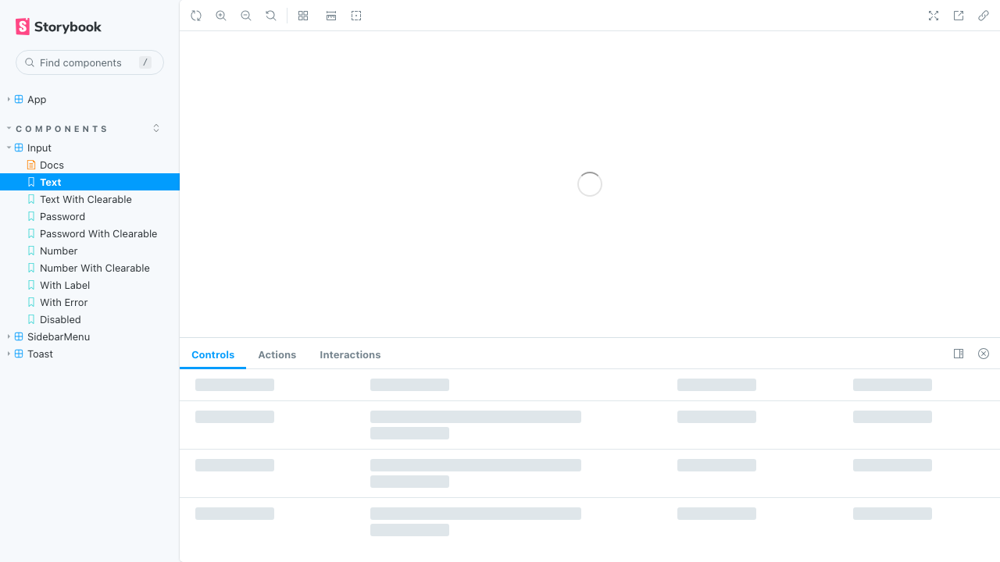
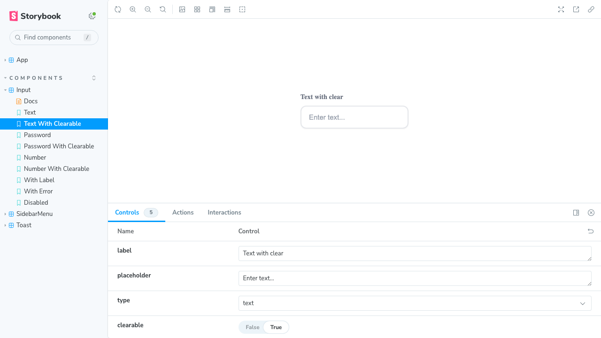
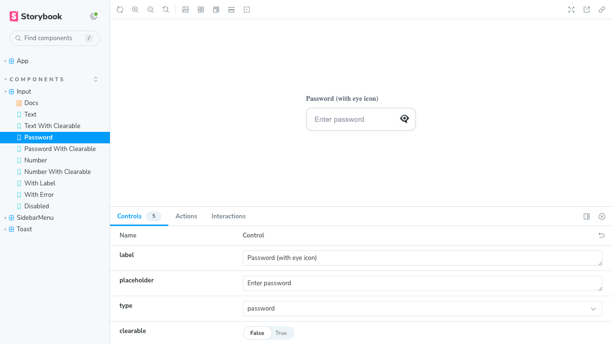
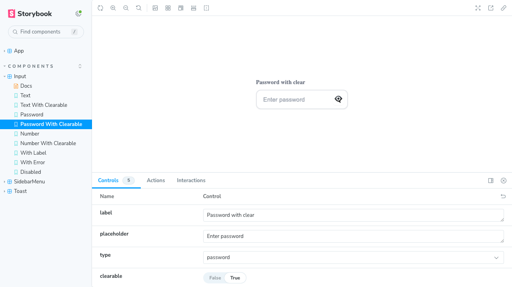
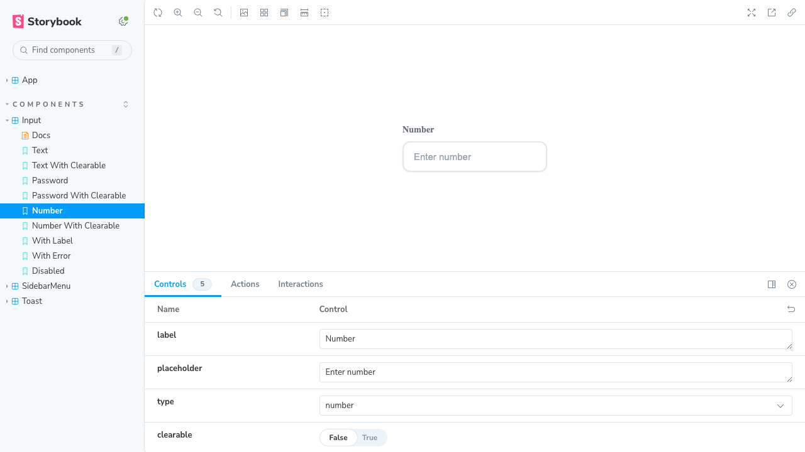
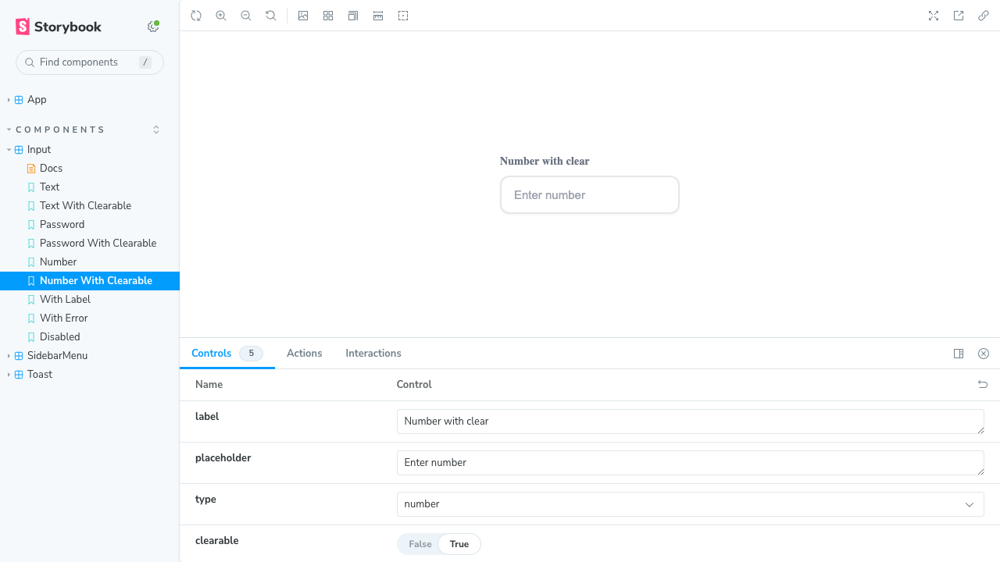
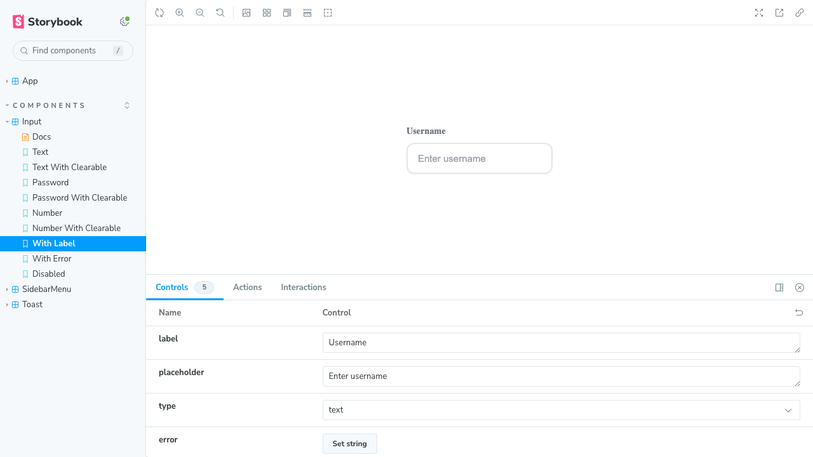
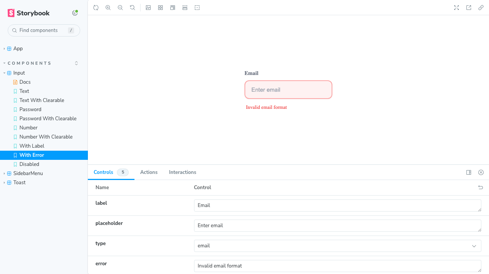
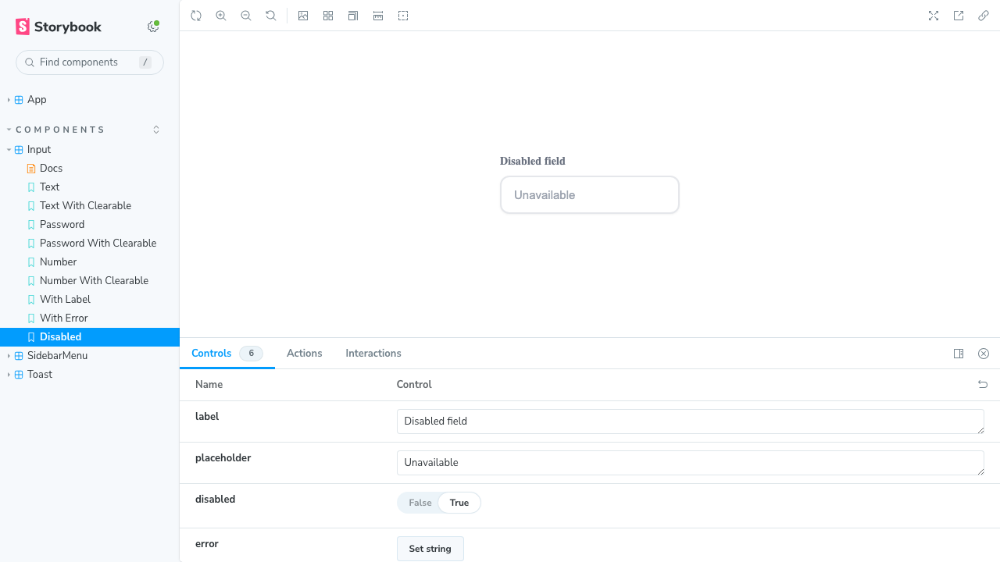

---

### 2. Toast Component

A component for displaying notifications with animations and auto-dismiss.

#### Features:
- **Positioning**: `bottom-right`, `bottom-left`, `top-right`, `top-left`
- **Animations**: fade and slide effects on appear and disappear
- **Auto-dismiss**: automatic close after specified duration
- **Close button**: optional manual close button
- **Types**: `success`, `error`, `warning`, `info`

#### Usage Examples:

```tsx
import { Toast } from './components';

// Basic Toast
<Toast 
  message="Operation completed successfully!" 
  type="success" 
/>

// Toast with close button
<Toast 
  message="Message with close button"
  type="info"
  showCloseButton={true}
/>

// Toast with long display
<Toast 
  message="Important message"
  type="warning"
  duration={10000}
/>
```

#### Screenshots:

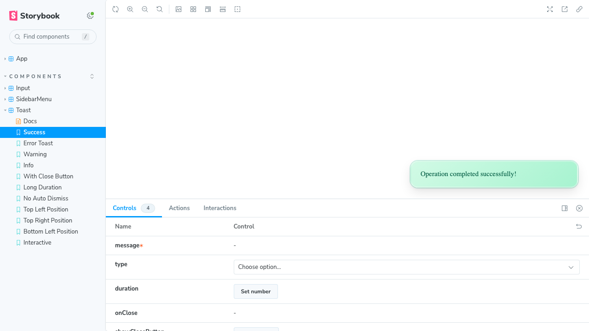
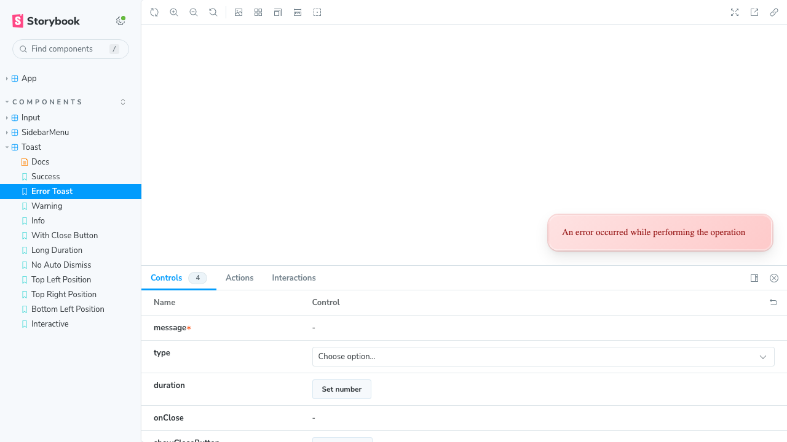
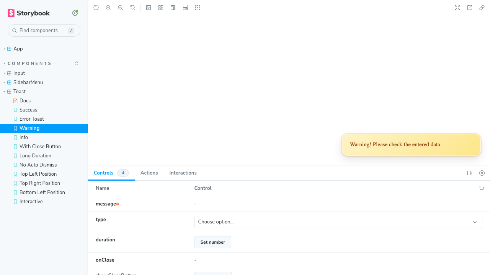
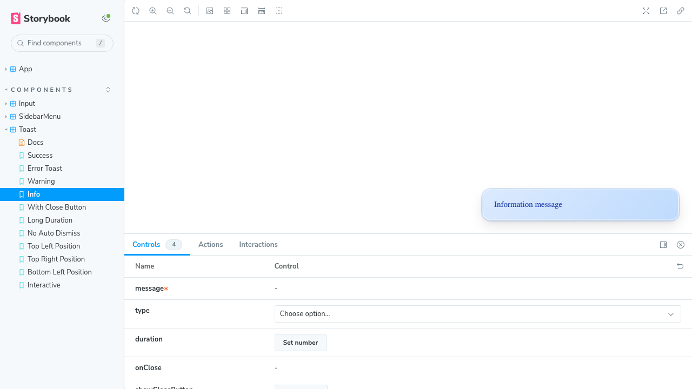
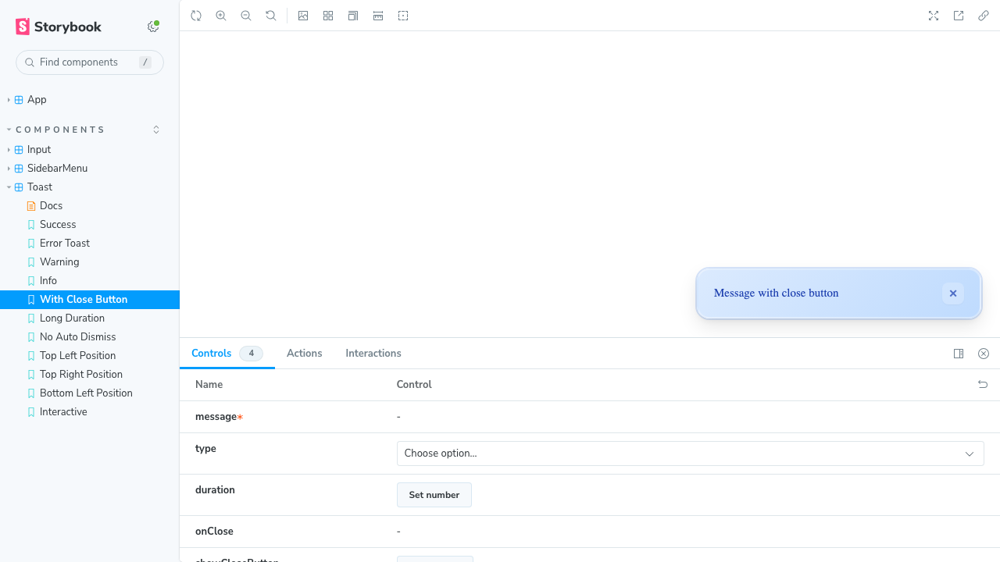
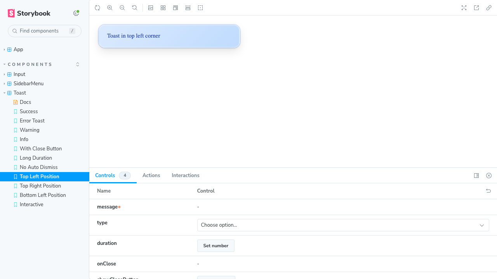
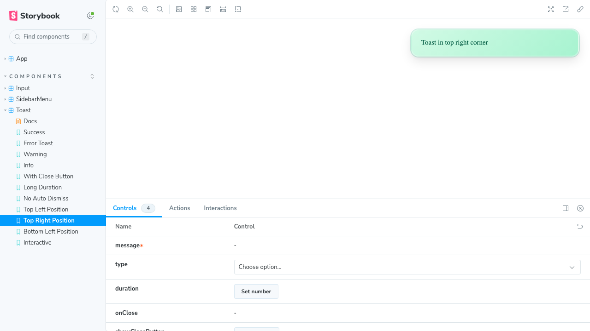
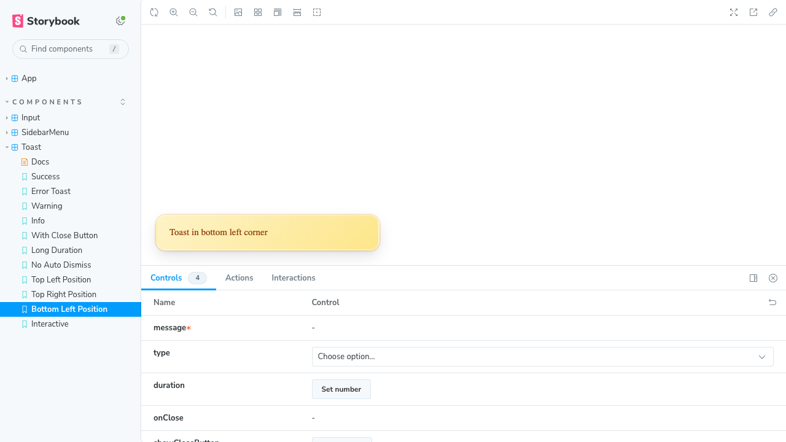

---

### 3. SidebarMenu Component

A sidebar menu with slide animation and nested menu support.

#### Features:
- **Slide animation**: smooth appearance from the right side
- **Nested menus**: support for multi-level menus (accordion)
- **Close on backdrop**: clicking the darkened background closes the menu
- **Active state**: highlight selected element
- **Icons**: support for icons in menu items

#### Usage Examples:

```tsx
import { SidebarMenu, MenuItem } from './components';

const items: MenuItem[] = [
  { 
    id: '1', 
    label: 'Home', 
    icon: '🏠',
    children: [
      { id: '1-1', label: 'Dashboard' },
      { id: '1-2', label: 'Analytics' },
    ]
  },
  { id: '2', label: 'Profile', icon: '👤' },
];

// Basic usage
<SidebarMenu 
  items={items} 
  isOpen={true}
  onClose={() => setIsOpen(false)}
/>

// With selected element
<SidebarMenu 
  items={items}
  defaultSelected="2"
  isOpen={true}
/>
```

#### Screenshots:


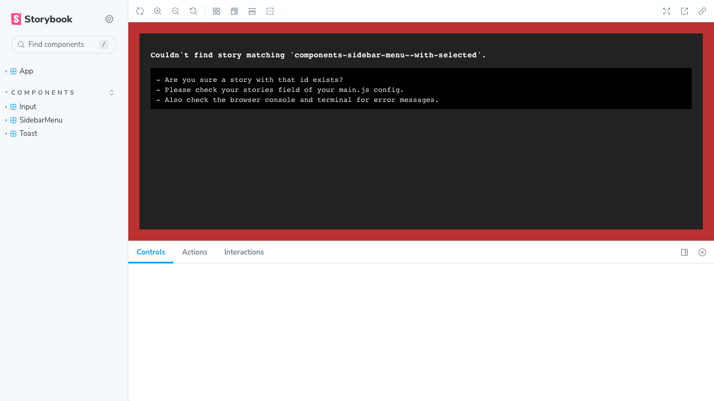


---

## 🛠️ Technologies

- **React 18** - UI library
- **TypeScript** - type safety
- **Vite** - build tool and dev server
- **Storybook 7.6** - component documentation and testing
- **Playwright** - automated screenshot generation
- **CSS** - styling (no inline styles)

## 📁 Project Structure

```
src/
├── components/
│   ├── Input/
│   │   ├── Input.tsx
│   │   ├── Input.css
│   │   ├── Input.stories.tsx
│   │   └── index.ts
│   ├── Toast/
│   │   ├── Toast.tsx
│   │   ├── Toast.css
│   │   ├── Toast.stories.tsx
│   │   └── index.ts
│   ├── SidebarMenu/
│   │   ├── SidebarMenu.tsx
│   │   ├── SidebarMenu.css
│   │   ├── SidebarMenu.stories.tsx
│   │   └── index.ts
│   └── index.ts
├── stories/
└── index.ts
```

## 🎨 Implementation Details

### Input Component
- Controlled component with internal state
- Support for all standard HTML attributes via spread operator
- Accessibility (aria-labels for buttons)

### Toast Component
- CSS animations for smooth appear/disappear
- Fixed positioning with corner selection
- Automatic timer cleanup on unmount

### SidebarMenu Component
- CSS transitions for slide animation
- Recursive rendering of nested menus
- State management for expanded elements using Set

## 📸 Screenshot Generation

Component screenshots are automatically generated using Playwright. The screenshot script (`scripts/screenshot.js`) captures all component stories and saves them to the `screenshots/` directory.

To regenerate screenshots after making changes:
1. Ensure Storybook is running (`npm run storybook`)
2. Run `npm run screenshot`

## 🧪 Testing

All components have Storybook stories demonstrating different states and configurations:

- **Input**: 8+ stories (different types, clearable, password toggle)
- **Toast**: 11+ stories (different types, positions, duration)
- **SidebarMenu**: 5+ stories (open/closed, nested menus)

## 📄 License

MIT

## 👤 Author

Created for Front-end JS engineer test assessment
